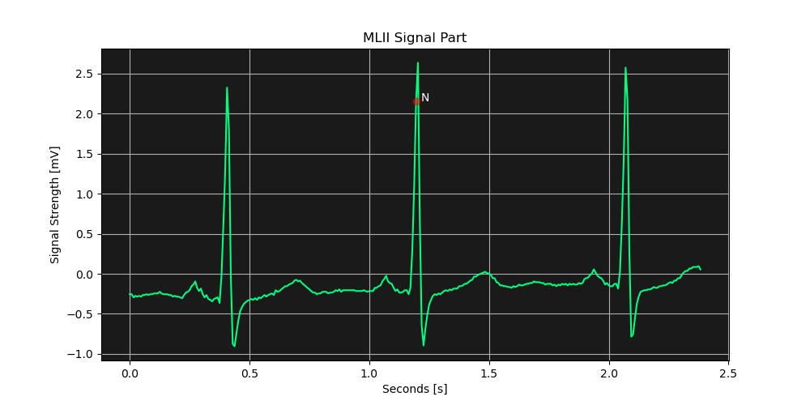
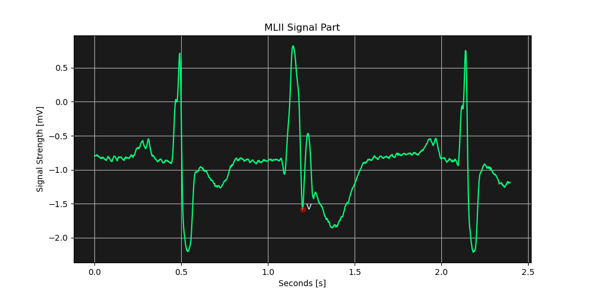
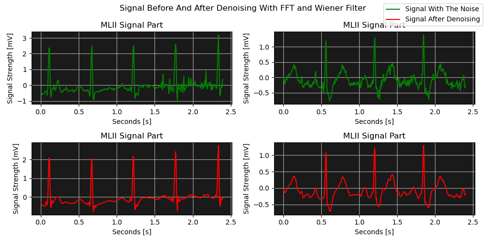
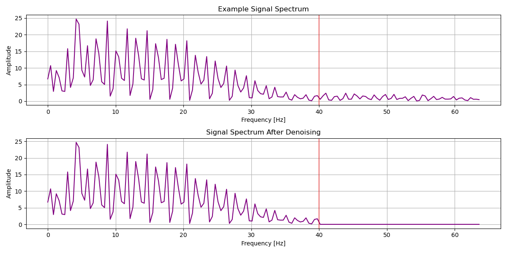
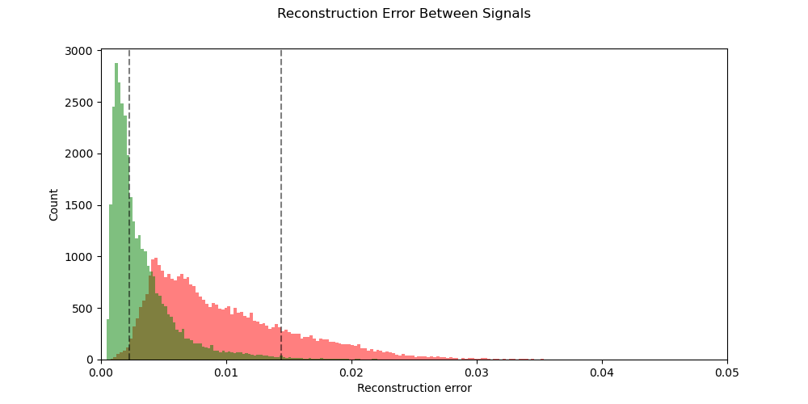
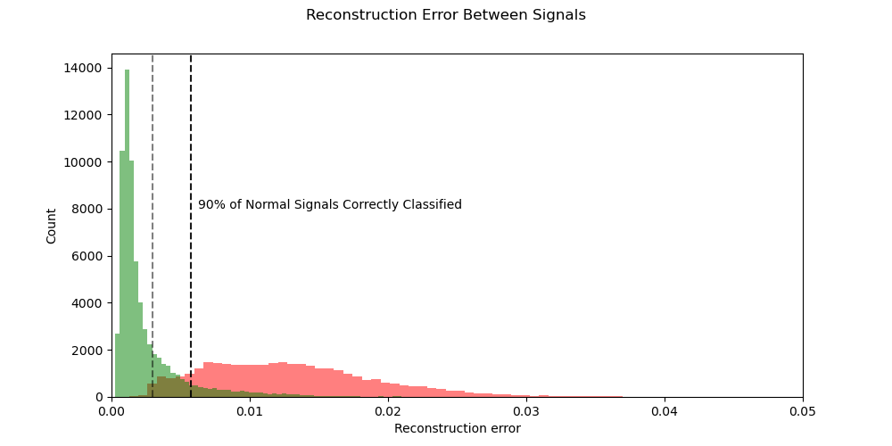

# ECG Heartbeat Signal Auto-Encoder Anomaly Detection

This app is the ECG signals live viewer with anomaly detection feature, which was the main objective of this project.
The model is a Deep Auto-Encoder, that has been taught on MIT-BIH ECG Signals Database.

### Preview Video

I recorded a short video showcasing the app in the action:
https://www.youtube.com/watch?v=yoRHshAQimg

---

||
|---|

---

# Project Workflow

### 1. Familarizing with the data

I started the project with getting know with the data and with what exactly the ECG signals are. I could see how some of the anomalies look like, due to the existance of them in the dataset.

### 2. EDA and Data Cleaning

When I was investigating how the signals look like, I've realized that there were some steps to be made:

- **Separation of the anomalied signal parts from the regular heartbeats**   
   I had to make sure, that the model would not see any of the anomalied parts of the signal in order to be accurate, so had to distinct these two types, below there are random samples of both normal and anomalied signals:
   | Normal | Anomalied |
   |---|---|
   |||

- **Normalization**   
   Signals coming from different patients, did not have the same value scale, so I had to fix it, knowing that it would be crucial for the detection algorythm.
   
- **Denoising**   
   Most of the signals contained noise, that I wanted to get rid of. I've experimented with **Wavelet** and **FFT** decomposition and denoising methods. 
   Eventually I've chosen a method with **FFT Frequencies cut-off** with selected threshold and applying the **Wiener Filter** afterwards. It just worked better in my opinion.
   | Denoising Results |
   |---|
   ||
   | Signal Frequency Spectrum - Thresholding |
   ||

- **Resampling**   
   The part of the signals, where the anomalied ones existed, had different **Sampling Rate**, So I had to make sure it is consistent.

### 3. Creating the model

I was experimenting with different Auto-Encoder architectures, trying to find the one, where I could specify the most accurate threshold for the error metric. 
I went from the model where the separation between anomalied and normal samples error was really inaccurate (huge overlap), to the model where it was way more sensible.

| Initial - Poor Model | Final Model |
|---|---|
|||

### 4. Implementing the model inside the app

I also wanted to see the model in a live action, seeing the predictions being made on each signal peak, so I has also written a simple app that allows user to tweak some of the model parameters, for example the threshold and provide with visible model predictions.

---

# App Preview

